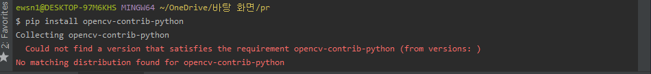
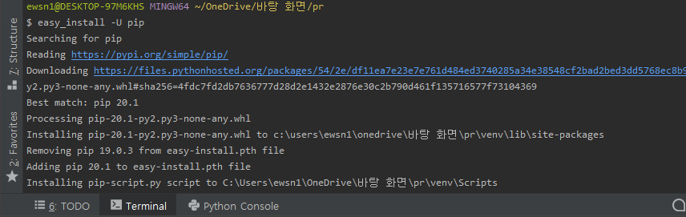
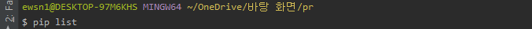
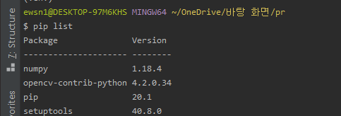

# 파이썬으로 얼굴 인식
파이썬과 __OpenCV__ 라이브러리를 활용해 웹캠의 라이브 영상으로부터 얼굴을 인식해 봅시다.  
OpenCV는 _Open Source Computer Vision_ 의 약자로 영상처리에 용이한 기능들이 포함되어 있는 오픈소스 라이브러리입니다.    

## OpenCV-Python 설치  
그럼 먼저 터미널에서 pip를 이용해 opencv를 설치합시다.  
```
$ source venv/Scripts/activate
$ pip install opencv-contrib-python  
```  
  
위와 같은 오류가 난다면, 아래의 명령을 이용해 pip를 업그레이드 한 다음 다시 opencv 설치를 시도합니다.  
```
$ easy_install -U pip
```  
  
  
  
  
`$ pip list` 명령어를 통해 잘 설치되었는지 다시 한번 확인해봅니다.  
  
잘 설치가 된 것을 확인할 수 있습니다. :)    

## 흐름
이번에 작성할 코드의 흐름은 다음과 같습니다.  
1. 사용할 얼굴 검출 모델 가져오기
2. 웹캠으로 화면 캡처
3. 캡처된 화면에서 얼굴 검출 모델 사용해 얼굴 검출
4. 검출된 얼굴의 위치를 캡처해둔 화면과 합성
5. 합성된 이미지 송출
6. 별도의 조작이 있기 전까지 3~6 반복  
  
OpenCV에서 기본적으로 몇 가지 특징을 검출하도록 사전훈련된 기계학습 모델을 제공합니다. 
각 모델은 xml 형태로 제공되며 가상환경 내 디렉토리 _venv/Lib/site-packages/cv2/data_ 에서 확인하실 수 있습니다.   
우리는 그 중에서도 정면 얼굴을 검출하도록 훈련된 모델을 사용할 것입니다.  

모델을 불러오고 난 후에는 여러분의 노트북에 달려 있는 내장 카메라를 활성화시킵니다.  
이 다음은 키보드로부터의 입력이 발생하기 전까지 반복문을 돌며   
__비디오 캡처, 캡처한 이미지에서 얼굴 검출, 이미지 합성, 합성한 이미지 송출__ 의  
과정을 반복합니다.  

참고로 OpenCV의 얼굴 검출 모델은 비올라와 존스가 고안한 알고리즘을 바탕으로 하고 있습니다.  
알고리즘에 대한 자세한 설명은 생략하도록 하겠습니다.    

## 얼굴 검출 코드 작성  
제일 먼저 사용할 라이브러리를 import로 가져와야겠죠?  
OpenCV는 cv2라는 이름으로 불러올 수 있습니다.  
```python
import cv2
```   

그 다음 frontalface_trained_xmlFile 이라는 변수를 선언하고 타겟 모델이 있는 경로를 문자열로 저장합니다.  
그리고 이를 이용해 얼굴 검출기를 하나 생성합니다  
`face.py`  
```python
import cv2

# 모델 데이터까지의 경로
frontalface_trained_xmlFile = "venv/Lib/site-packages/cv2/data/haarcascade_frontalface_default.xml"
# 얼굴 검출기 생성
face_detector = cv2.CascadeClassifier(frontalface_trained_xmlFile)
```
  
다음으로 비디오 캡처를 위한 코드를 작성합니다.  
인자를 이용해 캡처에 어떤 카메라를 이용할지 고를 수 있습니다.
카메라가 1개라면 0, 카메라가 여러개라면 1, 2, 3, ... 의 숫자를 사용해 카메라를 고를 수 있습니다.  
```python
# 비디오 캡처 카메라 선택
# 저는 놋북 카메라가 하나라서 기본인 0으로 인자를 전달합니다.
video = cv2.VideoCapture(0)
```  
video 변수를 이용해 비디오를 캡처할 수 있습니다.  
  
이제 남은 일은 키보드의 입력이 발생하기 전까지  
반복문 내에서 비디오를 캡처하고,    
해당 이미지에서 얼굴을 검출한 뒤,  
얻어낸 좌표를 이용해 얼굴을 표시해서,
송출하는 코드를 짜면 됩니다.  

```python
while True: #무한 반복
    ret, frame = video.read() #화면 캡처, ret에는 캡처 성공 여부, frame에는 캡처한 결과가 담긴다.
    
    #앞서 생성해둔 얼굴검출기로 얼굴을 찾아 faces 변수에 담는다.
    #비올라 존스 알고리즘은 명암 영상을 바탕으로 작동하므로 컬러 영상을 흑백으로 바꾼다. 
    #-> cv2.cvtColor(frame, cv2.COLOR_BGR2GRAY)
    #scaleFactor와 minNeightbors 는 알고리즘과 관련된 수치. 수정하면 성능에 변화가 생긴다. 자세한 설명은 생략
    faces = face_detector.detectMultiScale(cv2.cvtColor(frame, cv2.COLOR_BGR2GRAY), scaleFactor=1.08, minNeighbors=4)
```  
__video.read()__ 로 이미지를 캡처합니다. ret에는 성공 여부가, frame에는 캡처한 이미지가 담깁니다.  
그 다음 __face_detector.detectMultiScale()__ 을 이용해 캡처한 이미지로부터 얼굴을 찾아내는데,  
비올라 존스 알고리즘은 명암 영상을 바탕으로 작동하므로 __cv2.cvtColor()__를 이용해 이미지를 흑백으로 바꿉니다.  
_scaleFactor_ 와 _minNeighbors_ 는 알고리즘과 관계가 있습니다. 이와 관련한 자세한 내용은 생략하겠습니다.   
이렇게 찾아낸 얼굴들은 faces에 담깁니다.  
  
```python
    #찾은 얼굴 각각의 좌표를 이용해 사각형으로 표시 -> cv2.rectangle
    #표시된 곳 위에 텍스트를 써서 찾아낸 얼굴임을 표시 -> cv2.putText 
    for face in faces:
        x, y, w, h = face
        cv2.rectangle(frame, (x, y), (x + w, y + h), (0, 255, 0), 2)
        cv2.putText(frame, 'Face', (x, y - 5), cv2.FONT_HERSHEY_PLAIN, 2, (0, 0, 0), 2)
    
    #합성한 이미지를 송출
    cv2.imshow('Your Face', frame)

    #만약 키보드로부터 입력이 있다면 반복문을 벗어난다.
    if cv2.waitKey(1) > 0:
        break

video.release() #비디오 캡처 객체 해제
cv2.destroyAllWindows() # 창 닫기
```
찾아낸 얼굴들에 대한 정보를 x, y, w, h 각 변수에 담아 __cv2.rectangle()__ 함수로 사각형으로 이미지에 표시합니다.  
그리고 __cv2.putText()__ 함수로 찾아낸 얼굴임을 표시합니다.  
마지막으로 __cv2.imshow()__ 함수로 합성한 이미지를 최종적으로 송출합니다.  
__cv2.waitKey()__ 와 조건문을 활용해 키보드의 입력을 받을 시 반복문을 빠져나가도록 합니다.  

반복문을 빠져나가면 비디오 캡처 객체를 해제하고 모든 창을 닫습니다.   


전체 코드는 다음과 같습니다.
```python
import cv2

# 모델 데이터까지의 경로
frontalface_trained_xmlFile = "venv/Lib/site-packages/cv2/data/haarcascade_frontalface_default.xml"
# 얼굴 검출기 생성
face_detector = cv2.CascadeClassifier(frontalface_trained_xmlFile)

# 비디오 캡처 카메라 선택
# 저는 놋북 카메라가 하나라서 기본인 0으로 인자를 전달합니다.
video = cv2.VideoCapture(0)

while True:  # 무한 반복
    ret, frame = video.read()  # 화면 캡처, ret에는 캡처 성공 여부, frame에는 캡처한 결과가 담긴다.

    # 앞서 생성해둔 얼굴검출기로 얼굴을 찾아 faces 변수에 담는다.
    # 비올라 존스 알고리즘은 명암 영상을 바탕으로 작동하므로 컬러 영상을 흑백으로 바꾼다.
    # -> cv2.cvtColor(frame, cv2.COLOR_BGR2GRAY)
    # scaleFactor와 minNeightbors 는 알고리즘과 관련된 수치. 수정하면 성능에 변화가 생긴다. 자세한 설명은 생략
    faces = face_detector.detectMultiScale(cv2.cvtColor(frame, cv2.COLOR_BGR2GRAY), scaleFactor=1.08, minNeighbors=4)

    # 찾은 얼굴 각각의 좌표를 이용해 사각형으로 표시 -> cv2.rectangle
    # 표시된 곳 위에 텍스트를 써서 찾아낸 얼굴임을 표시 -> cv2.putText
    for face in faces:
        x, y, w, h = face
        cv2.rectangle(frame, (x, y), (x + w, y + h), (0, 255, 0), 2)
        cv2.putText(frame, 'Face', (x, y - 5), cv2.FONT_HERSHEY_PLAIN, 2, (0, 0, 0), 2)

    # 합성한 이미지를 송출
    cv2.imshow('Your Face', frame)

    # 만약 키보드로부터 입력이 있다면 반복문을 벗어난다.
    if cv2.waitKey(1) > 0:
        break

video.release()  # 비디오 캡처 객체 해제
cv2.destroyAllWindows()  # 창 닫기
```

