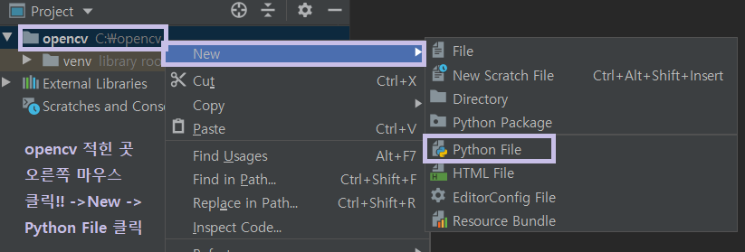
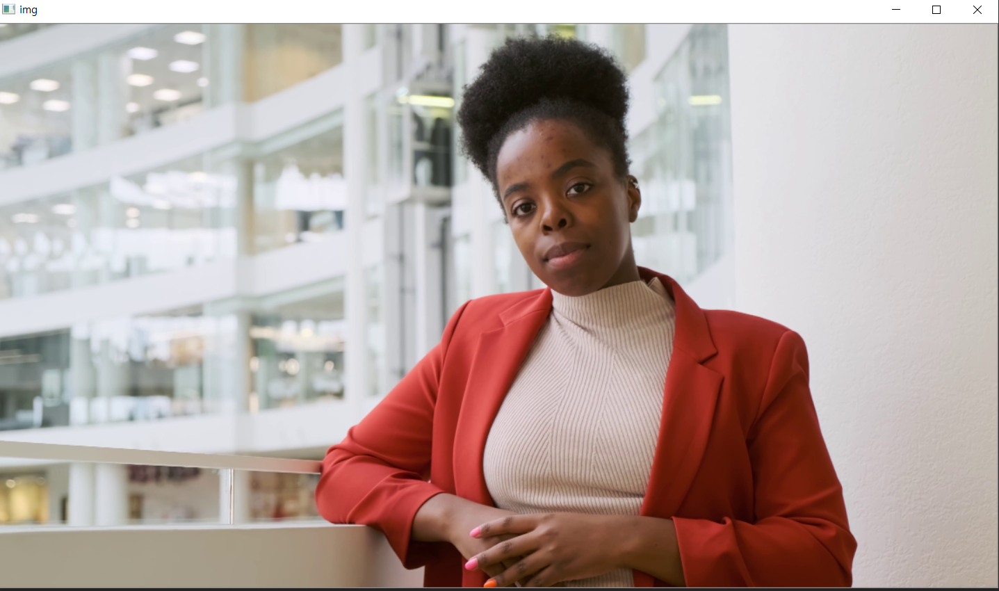
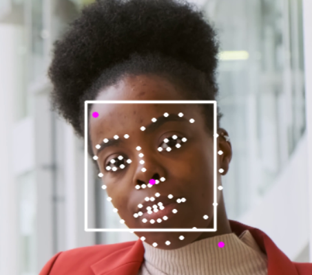
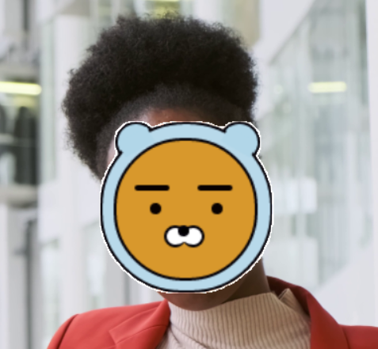

# 파이썬으로 얼굴 인식 심화

# python을 이용한 얼굴인식
### 1. opencv를 활용하자
#### opencv는 Open Source Computer Vision 의 약자이다.

* Open Source: 코드를 누구나 볼 수 있게 개방한 소스 
* Computer Vision: 사람의 시각 체계의 기능을 컴퓨터로 구현하는 것.
* 즉 opencv 는 사람의 눈을 대신한다고 생각하면 된다.


### 2. dlib를 활용하자

* 프로그래밍 언어 C ++로 작성된 범용 크로스 플랫폼 소프트웨어 라이브러리 
* Library: 컴퓨터 프로그램에서 자주 사용되는 부분 프로그램들을 모아 놓은 것.

### 3. numpy를 활용하자
* Numpy는 행렬 연산 library이다.
* 외부 패키지이므로 import 명령어를 통해 불러와야 한다.
```python
    import numpy as np
```
* numpy는 list 혹은 tuple을 데이터로 입력할 수 있다.


--------------------------
## PIP (python package index)
* pip은 python 패키지를 설치하고 관리하는 프로그램 이며,

명령어 pip을 통해 opencv , dlib, numpy 를 설치할 수 있습니다.


* 먼저, pycharm을 켜서 새로운 프로젝트를 생성해봅시다.


pycharm 하단에 있는 Terminal 버튼을 클릭해줍니다.


커서가 깜빡거리는게 보이시나요? 
 

``pip install opencv-contrib-python``을 치면 pycharm에서 자동으로
opencv가 설치가 됩니다.


똑같은 방식으로 ``pip install numpy``를 입력해주세요.


1. dlib을 설치하기 전 python 3.x 64bit를 설치해주세요 . python이 32bit이면 `pip install dlib`할 때 오류가 뜬답니다. 
2. dlib을 사용하기 위해서는 우선 ```pip install cmake```를 입력해서 `cmake`를 설치해주세요.
<br> dlib은  c++로 짜여진 언어이기 때문에 compiler가 필요합니다.  
https://visualstudio.microsoft.com/ko/thank-you-downloading-visual-studio/?sku=Community&rel=16

로 들어가서 visual studio를 깔아주세요.

visual studio installer에서 `c++를 사용한 데스크톱 개발`버튼을 클릭해서 설치해주세요.


설치를 완료 하셨으면 다시 pycharm으로 돌아가서 이전과 같이 terminal 창에서 `pip install dlib`을 해줍니다.


1단계를 완료했으니 이젠 python 코드를 작성해봅시다.

# 2단계

먼저 opencv(즉, 프로젝트명)을 클릭하신 후 사진 파일, 동영상파일과 dat파일을 붙여넣기 해줍니다.<br>

<br><br>
main.py 파일을 생성해주세요. <br>
-----------------------
이제 코드를 작성해봅시다.

```python
import cv2,dlib,sys
import numpy as np
# import를 사용하여 cv2,dlib,numpy를 불러옵니다.

cap = cv2.VideoCapture('video.mp4') 
# video.mp4 동영상 파일 로드 하겠다는 의미이며, 
# 파일 이름대신 0을 넣으면 웹캠이 켜지고 여러분 얼굴로 테스트가 가능합니다.

scaler = 0.3      
# 동영상 사이즈를 줄이기 위해 scaler 라는 변수를 이용해서 크기를 줄여 봅시다.

detector = dlib.get_frontal_face_detector()
predictor = dlib.shape_predictor('shape_predictor_68_face_landmarks.dat')

# 변수 detector과 predictor를 사용하여 얼굴과 얼굴 특징점을 찾아봅시다.
# 머신러닝으로 학습된 모델인 ~.dat파일을 그대로 사용해보겠습니다.

# --------------------------------------------------------------

#비디오가 실행되는 동안 일어날 일을 while문을 사용해서 코드를 짜줍니다.

while True:

    ret, img = cap.read()            #cap.read() : 동영상 파일에서 frame 단위로 읽어줍니다.

    if not ret:
        break
    
    img = cv2.resize(img, (int(img.shape[1] * scaler), int(img.shape[0] * scaler)) )   # cv2.resize(img, dsize) : img를 dsize 크기로 조절해줍니다.
    
    ori=img.copy()            # 원본이미지를 ori라는 이름으로 저장해봅시다.

    cv2.imshow('img',img)     #'img'라는 이름의 윈도우에 img를 띄울 수 있습니다.
   
    cv2.waitKey(1)            # 1ms만큼 대기한다는 뜻이며, 이걸 넣어야 동영상이 제대로 보입니다.
```

>terminal 창에서 `python main.py`를 실행시키면 동영상이 켜지는 것을 볼 수 있습니다.



## while 문 안에서 얼굴과 얼굴 특징점을 찾아봅시다.
```python
 while True:
    ret, img = cap.read()
    if not ret:
        break
    img = cv2.resize(img, (int(img.shape[1] * scaler), int(img.shape[0] * scaler)) )
    ori = img.copy()  
 
    faces = detector(img)      # img에서 모든 얼굴 찾아봅시다.
    face = faces[0]            # 찾은 모든 얼굴에서 첫번째 얼굴만 가져옵시다.  

    dlib_shape = predictor(img,face)

    shape_2d =np.array([[p.x, p.y] for p in dlib_shape.parts()])  
    #dlib 객체를 numpy객체로 변환해서 좌표축 개념으로 shape_2d라는 변수에 저장해봅시다.

    top_left = np.min(shape_2d,axis=0)                #얼굴의 좌상단, 우하단, 중심 부분을 잡아봅시다.
    bottom_right =np.max(shape_2d, axis=0)

    center_x, center_y = np.mean(shape_2d, axis=0).astype(np.int) # 특징점의 평균을 구해서 중심부분을 잡습니다.numpy 행렬을 np.int 타입으로 변환합니다.

    img = cv2.rectangle(img, pt1=(face.left(), face.top()), pt2=( face.right(), face.bottom()), color=(255,255,255), thickness=2, lineType=cv2.LINE_AA)
    #cv2.rectangle를 이용하여 얼굴에 네모칸을 쳐 봅시다.

    for s in shape_2d:    #원 모양으로 얼굴 특징점을 추출해봅시다.
        cv2.circle(img, center=tuple(s), radius=1, color=(255, 255, 255), thickness=2, lineType=cv2.LINE_AA)

    cv2.circle(img, center=tuple(top_left), radius=1, color=(255, 0, 255), thickness=4, lineType=cv2.LINE_AA)    #얼굴의 좌상단을 자주색원으로 표시
    cv2.circle(img, center=tuple(bottom_right), radius=1, color=(255, 0, 255), thickness=4, lineType=cv2.LINE_AA)  #얼굴의 우하단
    cv2.circle(img, center=tuple((center_x, center_y)), radius=1, color=(255, 0, 255), thickness=4, lineType=cv2.LINE_AA) #얼굴의 중심

    cv2.imshow('img',img)       #얼굴 특징점 띄우기
    cv2.waitKey(1)
```
>`python main.py`를 입력하여 얼굴에 네모칸이 쳐지는지, 얼굴 특징점이 추출되는지 확인해봅시다.<br>
> Terminal 창에서 Ctrl+C  를 누르면 다시 코드를 작성할 수 있습니다.


--------------------------------------
## 라이언 얼굴을 띄워봅시다.
1. while문 밖; predictor 밑에 줄에 추가해줍시다.
```python
overlay = cv2.imread('ryan_transparent', cv2.IMREAD_UNCHANGED)

#아래의 함수를 Ctrl+C, Ctrl+V 해줍니다.

# overlay function
def overlay_transparent(background_img, img_to_overlay_t, x, y, overlay_size=None):
  bg_img = background_img.copy()
  # convert 3 channels to 4 channels
  if bg_img.shape[2] == 3:
    bg_img = cv2.cvtColor(bg_img, cv2.COLOR_BGR2BGRA)

  if overlay_size is not None:
    img_to_overlay_t = cv2.resize(img_to_overlay_t.copy(), overlay_size)

  b, g, r, a = cv2.split(img_to_overlay_t)

  mask = cv2.medianBlur(a, 5)

  h, w, _ = img_to_overlay_t.shape
  roi = bg_img[int(y-h/2):int(y+h/2), int(x-w/2):int(x+w/2)]

  img1_bg = cv2.bitwise_and(roi.copy(), roi.copy(), mask=cv2.bitwise_not(mask))
  img2_fg = cv2.bitwise_and(img_to_overlay_t, img_to_overlay_t, mask=mask)

  bg_img[int(y-h/2):int(y+h/2), int(x-w/2):int(x+w/2)] = cv2.add(img1_bg, img2_fg)

  # convert 4 channels to 4 channels
  bg_img = cv2.cvtColor(bg_img, cv2.COLOR_BGRA2BGR)

  return bg_img

```

2. while문 안
center_x, center_y 앞뒤로 코드를 작성해줍니다.
```python
face_size =  int (max(bottom_right - top_left) *1.2 )

center_x, center_y = np.mean(shape_2d, axis=0).astype(np.int)

result = overlay_transparent(ori,overlay, center_x +8 ,center_y -25 , overlay_size=(face_size, face_size))
```

cv2.imshow() 함수를 이용하여 result를 띄워봅시다.
맨밑에서 바로 윗줄에 추가해주세요.
```python
cv2.imshow('result', result)   # 라이언 얼굴 띄우기
```

>`python main.py`를 입력하여 결과를 확인합니다.


# 전체 소스 코드
```python
import cv2, dlib,sys
import numpy as np

cap = cv2.VideoCapture('video.mp4')

scaler = 0.3

detector = dlib.get_frontal_face_detector()
predictor =dlib.shape_predictor('shape_predictor_68_face_landmarks.dat')

overlay = cv2.imread('ryan_transparent.png', cv2.IMREAD_UNCHANGED)

# overlay function
def overlay_transparent(background_img, img_to_overlay_t, x, y, overlay_size=None):
  bg_img = background_img.copy()
  # convert 3 channels to 4 channels
  if bg_img.shape[2] == 3:
    bg_img = cv2.cvtColor(bg_img, cv2.COLOR_BGR2BGRA)

  if overlay_size is not None:
    img_to_overlay_t = cv2.resize(img_to_overlay_t.copy(), overlay_size)

  b, g, r, a = cv2.split(img_to_overlay_t)

  mask = cv2.medianBlur(a, 5)

  h, w, _ = img_to_overlay_t.shape
  roi = bg_img[int(y-h/2):int(y+h/2), int(x-w/2):int(x+w/2)]

  img1_bg = cv2.bitwise_and(roi.copy(), roi.copy(), mask=cv2.bitwise_not(mask))
  img2_fg = cv2.bitwise_and(img_to_overlay_t, img_to_overlay_t, mask=mask)

  bg_img[int(y-h/2):int(y+h/2), int(x-w/2):int(x+w/2)] = cv2.add(img1_bg, img2_fg)

  # convert 4 channels to 4 channels
  bg_img = cv2.cvtColor(bg_img, cv2.COLOR_BGRA2BGR)

  return bg_img


while True:
    ret, img = cap.read()
    if not ret:
        break
    img = cv2.resize(img, (int(img.shape[1] * scaler), int(img.shape[0] * scaler)))
    ori = img.copy()

    faces = detector(img)  
    face = faces[0]       

    dlib_shape = predictor(img, face)

    shape_2d = np.array([[p.x, p.y] for p in dlib_shape.parts()])
  

    top_left = np.min(shape_2d, axis=0)  
    bottom_right = np.max(shape_2d, axis=0)
    face_size = int(max(bottom_right - top_left) * 1.2)

    center_x, center_y = np.mean(shape_2d, axis=0).astype(np.int)

    result = overlay_transparent(ori, overlay, center_x + 8, center_y - 25, overlay_size=(face_size, face_size))

    img = cv2.rectangle(img, pt1=(face.left(), face.top()), pt2=(face.right(), face.bottom()), color=(255, 255, 255),
                        thickness=2, lineType=cv2.LINE_AA)
    

    for s in shape_2d:   
        cv2.circle(img, center=tuple(s), radius=1, color=(255, 255, 255), thickness=2, lineType=cv2.LINE_AA)

    cv2.circle(img, center=tuple(top_left), radius=1, color=(255, 0, 255), thickness=4,
               lineType=cv2.LINE_AA)  
    cv2.circle(img, center=tuple(bottom_right), radius=1, color=(255, 0, 255), thickness=4,
               lineType=cv2.LINE_AA)  
    cv2.circle(img, center=tuple((center_x, center_y)), radius=1, color=(255, 0, 255), thickness=4,
               lineType=cv2.LINE_AA)  

    cv2.imshow('img', img)   # 얼굴 특징점 띄우기
    cv2.imshow('result', result)  # 라이언 얼굴 띄우기
    cv2.waitKey(1)
```
