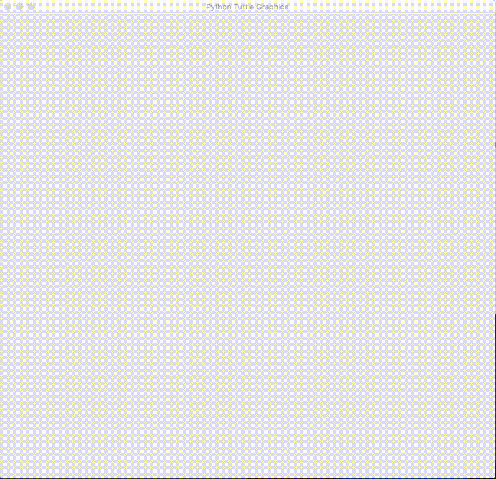

# 포트리스
파이썬을 활용해 포트리스를 만들어 보자



지난번 수업했던 [파이썬으로 경북대 로고 그리기](https://github.com/haedal-with-knu/HaedalTube/blob/master/Docs/Python%20turtle%20art.md)에서 사용한 `python turtle`을 활용해 간단한 포트리스를 만들어보겠습니다.  
대전게임(?)을 만들고 싶었지만, 대포 1개만 넣어도 교육자료로썬 충분한 난이도일 듯 하여 대포 1개가 혼자서 쏘는 형태입니다.  


대포가 쏘는 포탄의 날아가는 궤적을 생각해보면 보통 포물선이겠지만,  
`Turtle` 라이브러리로 코드를 짜는 것으로 한정한다면 쉬운 일이 아닙니다. 추후 도전해보실 만한 주제로 해당 문서 마지막에 정리해두겠습니다.

## 포탄이 날아가는 궤적 파악


* 포탄이 날아가는 모양새는 썩 맘에들지 않는다.
* 비교적 쉬운 코드로 작성이 가능하다


* 상상했던 포탄이 날아가는 모습이 보인다.
* 포탄의 궤적을 계산하기위해 많은 변수와 연산자들의 향연으로 코드가  복잡해진다

```python
import turtle as t
import random

def turn_up():            # ↑를 눌렀을 때 호출되는 함수
  t.left(2)             # 거북이를 왼쪽으로 2도 돌립니다.

def turn_down():          #↓를 눌렀을 때 호출되는 함수
  t.right(2)            # 거북이를 오른쪽으로 2도 돌립니다.

def fire():               #SpaceBar를 누르면 거북이 대포를 발사합니다.
  ang = t.heading()     # 현재 거북이가 바라보는 각도를 기억합니다.
  while t.ycor() > 0:   # 거북이가 땅 위에 있는 동안 반복합니다.
    t.forward(15)     # 15만큼 앞으로 이동합니다.
    t.right(5)        # 오른쪽으로 5도 회전합니다.

 

  # while 반복문을 빠져나오면 거북이가 땅에 닿은 상태입니다.
  d = t.distance(target, 0)       # 거북이와 목표 지점과의 거리를 구합니다.
  t.sety(random.randint(10, 100)) # 성공 또는 실패를 표시할 위치를 지정합니다.
  if d < 25: # 거리 차이가 25보다 작으면 목표 지점에 명중한 것으로 처리합니다.
    t.color("blue")
    t.write("Good!", False, "center", ("", 15))

  else:     # 그렇지 않으면 실패한 것으로 처리합니다.
    t.color("red")
    t.write("Bad!", False, "center", ("", 15))

  t.color("black")    # 거북이 색을 검은색으로 되돌립니다.
  t.goto(-200, 10)    # 거북이 위치를 처음 발사했던 곳으로 되돌립니다.
  t.setheading(ang)   # 각도도 처음 기억해 둔 각도로 되돌립니다.

 

# 주의 : 여기서부터는 들여쓰기를 하지 마세요.

# 땅을 그립니다.
t.goto(-300, 0)
t.down()
t.goto(300, 0)

 

# 목표 지점을 설정하고 그립니다.
target = random.randint(50, 150) # 목표 지점을 50~150 사이에 있는 임의의 수로 지정합니다.
t.pensize(3)
t.color("green")
t.up()
t.goto(target - 25, 2)
t.down()
t.goto(target + 25, 2)

# 거북이 색을 검은색으로 지정하고 처음 발사했던 곳으로 되돌립니다.
t.color("black")
t.up()
t.goto(-200, 10)
t.setheading(20)

# 거북이가 동작하는 데 필요한 설정을 합니다.
t.onkeypress(turn_up, "Up")      # ↑를 누르면 turn_up 함수를 실행합니다.
t.onkeypress(turn_down, "Down")  # ↓를 누르면 turn_down 함수를 실행합니다.
t.onkeypress(fire, "space")      # SpaceBar를 누르면 fire 함수를 실행합니다.
t.listen()                       # 거북이 그래픽 창이 키보드 입력을 받도록 합니다.
```