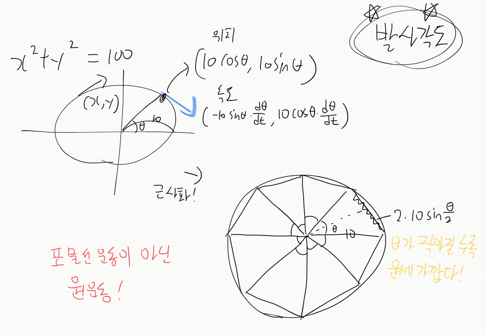

# 포트리스
파이썬을 활용해 포트리스를 만들어 봅니다


지난번 수업했던 [파이썬으로 경북대 로고 그리기](https://github.com/haedal-with-knu/HaedalTube/blob/master/Docs/Python%20turtle%20art.md)에서 사용한 `python turtle`을 활용해 간단한 포트리스를 만들어 보겠습니다  
대전게임(?)을 만들고 싶었지만, 대포 1개만 넣어도 교육자료로썬 충분한 난이도일 듯 하여 대포 1개가 혼자서 쏘는 형태입니다  


대포가 쏘는 포탄의 날아가는 궤적을 생각해보면 보통 포물선이겠지만,  
`Turtle` 라이브러리로 코드를 짜는 것으로 한정한다면 쉬운 일이 아닙니다  
추후 도전해보실 만한 주제로 해당 문서 마지막에 정리해두겠습니다

## 포탄이 날아가는 궤적 파악
### 원 궤적

* 포탄이 날아가는 모양새는 썩 맘에 들지 않습니다
* 비교적 쉬운 코드로 작성이 가능합니다
### 포물선 궤적

* 상상했던 포탄이 날아가는 모습이 보입니다
* 포탄의 궤적을 계산하기 위해 많은 변수와 연산자들의 향연으로 코드가 복잡해집니다

> 현재 교육문서에서는 원 궤적을 중점으로 기술합니다  
> Pycharm에서 turtle 모듈이 작동이 잘 안되는 경우, Python Idle를 사용해주세요


### [지난 시간에 배운 `python turtle`을 활용](https://github.com/haedal-with-knu/HaedalTube/blob/master/Docs/Python%20turtle%20art.md)

## Python Turtle 모듈 함수
시작하기 전에 `python turtle` 모듈을 사용하기 위해서는 다음 코드를 파이썬 코드 제일 위에 작성해야 합니다.
```python
import turtle as t
```
이 코드를 사용하면 turtle 모듈을 불러오고 turtle 대신 t를 사용할 수 있습니다.

```python
import random
```
문서 맨 위에서 보여지는 초록색 표적의 위치를 랜덤하게 설정하기 위해,  
`random` 모듈을 불러옵니다.

## 포트리스 게임 화면 띄우기

포트리스를 진행할 게임 화면을 띄웁니다
`(-300,0)~(300,0)`에 땅을 그립니다.
```python
import turtle as t
import random

# 땅을 왼쪽부터 그립니다
# (-300, 0)으로 간다
t.goto(-300, 0)
# (300, 0)으로 간다
t.goto(300, 0)
```

## 목표 낙하지점 설정

오른쪽 편에 낙하지점을 설정하고,  
왼쪽에서 포탄을 쏘도록 대포를 배치합니다.
```python
# 목표 지점을 설정하고 그립니다
# 목표 지점을 50~150 사이에 있는 임의의 수로 지정합니다
target = random.randint(50, 150) 
# 펜 굵기는 3으로 강조, 기본이 1입니다
t.pensize(3)
# 색상은 초록색
t.color("green")
# 낙하지점으로 이동합니다
t.up()
t.goto(target - 25, 2)
# 초록색으로 그립니다
t.down()
t.goto(target + 25, 2)

# 거북이 색을 검은색으로 지정하고 처음 발사했던 곳으로 되돌립니다
t.color("black")
t.up()
t.goto(-200, 10)
# 발사각도는 20도로 설정합니다
t.setheading(20)
```

## 내 맘대로 대포쏘자
방향키 `↑`, `↓`를 이용해 발사각도를 조절하고,  
`SpaceBar`를 이용해 대포를 발사합니다
키보드를 누르면 파이썬이 알아듣도록 코드를 작성합니다
```python
# 거북이가 동작하는 데 필요한 설정을 합니다
# ↑를 누르면 turn_up 함수를 실행합니다
t.onkeypress(turn_up, "Up")      
# ↓를 누르면 turn_down 함수를 실행합니다
t.onkeypress(turn_down, "Down")  
# SpaceBar를 누르면 fire 함수를 실행합니다
t.onkeypress(fire, "space")      
# 거북이 그래픽 창이 키보드 입력을 받도록 합니다
t.listen()                       
```
## 방향키 `↑`, `↓` 입력
함수들의 위치는 위의 `onkeypress(turn_up, "Up")` 구문들보다 위에 있어야 합니다  
`import random` 구문 바로 아래 넣으면 좋을 듯 합니다  
영상 강의를 참고해, 붙여넣는 위치를 잘 파악해주세요  

방향키 `↑`, `↓`를 이용해 발사각도를 조절하는 함수를 작성합니다  
`↑`로 동작하는 `turn_up`함수는 발사각도를 높이고,  
`↓`로 동작하는 `turn_down`함수는 발사각도를 낮춥니다.
```python
# ↑를 누르면 발사각도를 높이는 turn_up 함수
def turn_up():          
  # 거북이를 왼쪽으로 2도 돌립니다  
  t.left(2)             

# ↓를 누르면 발사각도를 낮추는 turn_down 함수
def turn_down():        
  # 거북이를 오른쪽으로 2도 돌립니다  
  t.right(2)            
```
## `SpaceBar` 입력
`SpaceBar`를 이용해 거북이 대포를 발사하는 `fire` 함수를 작성합니다
```python
# SpaceBar를 누르면 거북이 대포를 발사하는 fire 함수
def fire():             
  # 현재 거북이가 바라보는 각도를 기억합니다 
  ang = t.heading()     
  # 거북이가 땅 위에 있는 동안 반복합니다
  while t.ycor() > 0: 
    # 15만큼 앞으로 이동합니다  
    t.forward(15)     
    # 오른쪽으로 5도 회전합니다
    t.right(5) 

  # while 반복문을 빠져나오면 거북이가 땅에 닿은 상태입니다
  # 거북이와 목표 지점과의 거리를 구합니다
  d = t.distance(target, 0)       
  # 성공 또는 실패를 표시할 위치를 지정합니다
  t.sety(random.randint(10, 100)) 
  # 거리 차이가 25보다 작으면 목표 지점에 명중한 것으로 처리합니다
  if d < 25: 
    t.color("blue")
    t.write("Good!", False, "center", ("", 15))
  # 그렇지 않으면 실패한 것으로 처리합니다
  else:     
    t.color("red")
    t.write("Bad!", False, "center", ("", 15))
  
  # 거북이 색을 검은색으로 되돌립니다
  t.color("black")    
  # 거북이 위치를 처음 발사했던 곳으로 되돌립니다
  t.goto(-200, 10)    
  # 각도도 처음 기억해 둔 각도로 되돌립니다
  t.setheading(ang)   
```


## 전체코드
맨 처음에 봤었던 실행화면이 올바르게 작동하나요?  
안되더라도 실망하지 말아요 :)
  

```python
import turtle as t
import random

# ↑를 누르면 발사각도를 높이는 turn_up 함수
def turn_up():          
  # 거북이를 왼쪽으로 2도 돌립니다  
  t.left(2)             

# ↓를 누르면 발사각도를 낮추는 turn_down 함수
def turn_down():        
  # 거북이를 오른쪽으로 2도 돌립니다  
  t.right(2)            

# SpaceBar를 누르면 거북이 대포를 발사하는 fire 함수
def fire():             
  # 현재 거북이가 바라보는 각도를 기억합니다 
  ang = t.heading()     
  # 거북이가 땅 위에 있는 동안 반복합니다
  while t.ycor() > 0: 
    # 15만큼 앞으로 이동합니다  
    t.forward(15)     
    # 오른쪽으로 5도 회전합니다
    t.right(5)        

  # while 반복문을 빠져나오면 거북이가 땅에 닿은 상태입니다
  # 거북이와 목표 지점과의 거리를 구합니다
  d = t.distance(target, 0)       
  # 성공 또는 실패를 표시할 위치를 지정합니다
  t.sety(random.randint(10, 100)) 
  # 거리 차이가 25보다 작으면 목표 지점에 명중한 것으로 처리합니다
  if d < 25: 
    t.color("blue")
    t.write("Good!", False, "center", ("", 15))
  # 그렇지 않으면 실패한 것으로 처리합니다
  else:     
    t.color("red")
    t.write("Bad!", False, "center", ("", 15))
  
  # 거북이 색을 검은색으로 되돌립니다
  t.color("black")    
  # 거북이 위치를 처음 발사했던 곳으로 되돌립니다
  t.goto(-200, 10)    
  # 각도도 처음 기억해 둔 각도로 되돌립니다
  t.setheading(ang)   

# 주의 : 여기서부터는 들여쓰기를 하지 마세요.

# 땅을 왼쪽부터 그립니다
# (-300, 0)으로 간다
t.goto(-300, 0)
# (300, 0)으로 간다
t.goto(300, 0)

# 목표 지점을 설정하고 그립니다
# 목표 지점을 50~150 사이에 있는 임의의 수로 지정합니다
target = random.randint(50, 150) 
# 펜 굵기는 3으로 강조, 기본이 1입니다
t.pensize(3)
# 색상은 초록색
t.color("green")
# 낙하지점으로 이동합니다
t.up()
t.goto(target - 25, 2)
# 초록색으로 그립니다
t.down()
t.goto(target + 25, 2)

# 거북이 색을 검은색으로 지정하고 처음 발사했던 곳으로 되돌립니다
t.color("black")
t.up()
t.goto(-200, 10)
# 발사각도는 20도로 설정합니다
t.setheading(20)

# 거북이가 동작하는 데 필요한 설정을 합니다
# ↑를 누르면 turn_up 함수를 실행합니다
t.onkeypress(turn_up, "Up")      
# ↓를 누르면 turn_down 함수를 실행합니다
t.onkeypress(turn_down, "Down")  
# SpaceBar를 누르면 fire 함수를 실행합니다
t.onkeypress(fire, "space")      
# 거북이 그래픽 창이 키보드 입력을 받도록 합니다
t.listen()     

```

## 마무리
한번에 되는 친구들도 있고, 안되는 친구들도 있을 겁니다  
문서를 찬찬히 읽고, 영상을 반복해서 보면 충분히 따라올 수 있을 겁니다  
무작정 따라하시며 배우면서 무엇을 모르는지 알게되고, 다음 단계가 보일 겁니다  
이제 시작이니 차근차근 따라와주세요 :)

포물선 궤적의 코드는 아직 진행하기 어렵다 판단해서,  
추후 진행할 수 있다면 교육자료를 제작하도록 하겠습니다 :)