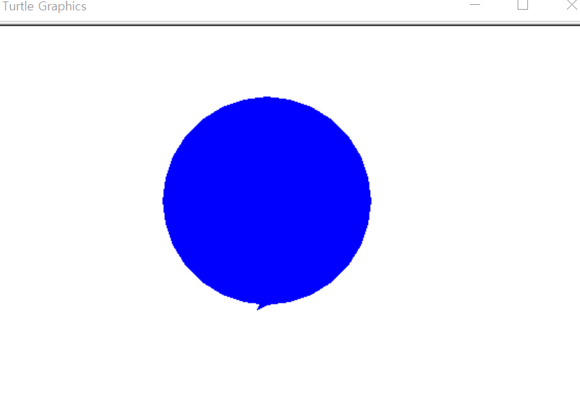
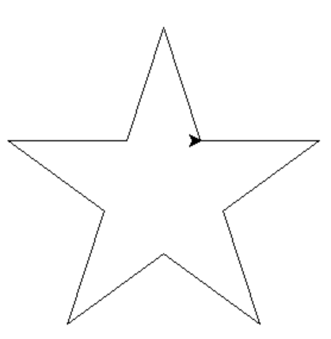
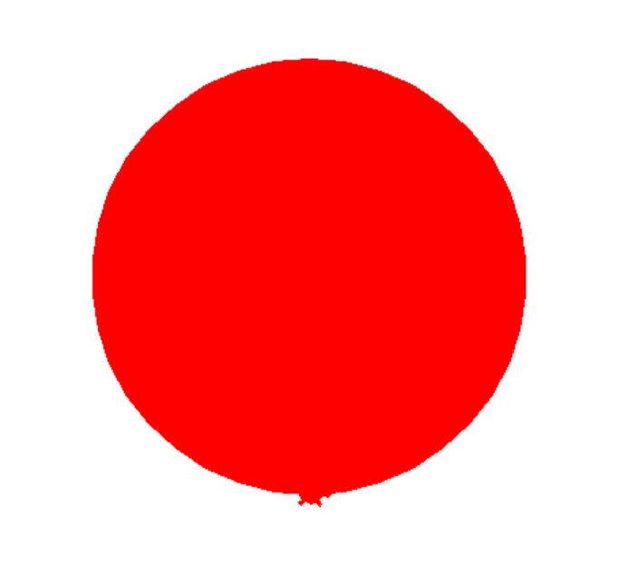
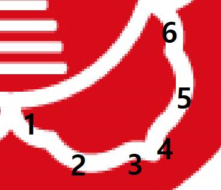

# Python Turtle art 
>이번 시간에는 `python turtle`을 활용하여 그림을 그려보겠습니다.
>## Python Turtle 이란?
>
>`python turtle` 모듈은 펜의 움직임, 펜의 사이즈 지정, 펜 들어올리기, 내리기 등의 기능이 `메소드(method)`로 구현되어 있습니다.
><br>터틀 모듈을 `임포트(import)` 하면 터틀 `객체(object)`를 생성할 수 있고, 명령을 실행 하기 위해 터틀 객체의 `메소드(method)`를 호출 할 수 있습니다.
>
>## Python Turtle 모듈 함수
>시작하기 전에 `python turtle` 모듈을 사용하기 위해서는 다음 코드를 파이썬 코드 제일 위에 작성해야 합니다.
>```python
>import turtle
>``` 
>혹은
>```python
>import turtle as t
>```
> 이 코드를 사용하면 turtle 모듈을 불러오고 turtle 대신 t를 사용할 수 있습니다.
><br><br>간단한 함수들을 먼저 살펴보겠습니다.
><br>아래의 표에  모듈 함수들과 각 함수가 하는 일에 대해 정리에 놓았습니다.
><br>
>
>+ 터틀 펜 상태 메소드
>
>함수(Method) | 설명(Description)
>--- | ---
>turtle.penup()| 펜을 들어올린다. 펜을 움직여도 그려지지 않는다.
>turtle.pendown()| 펜을 내려놓는다. 펜을 움직이면 선이 그려진다.
>turtle.pencolor("color") | 펜 컬러 지정
>turtle.pensize(n) | 펜 두계 지정
>
>+ 터틀 모션 메소드
>
>함수(Method) | 설명(Description)
>---|---
>turtle.forward(d)| 터틀 머리가 향한 방향으로 d만큼 이동
>turtle.backward(d)|터틀 꼬리 방향으로 d만큼 이동
>turtle.right(angle)|오른쪽으로 angle 만큼 방향 전환
>turtle.left(angle)|왼쪽으로 angle 만큼 방향 전환
>turtle.goto(x,y)| 터틀을 (x, y) 위치로 이동
>turtle.setx(p)|터틀을 x축의 p 위치로 이동
>turtle.sety(p)|터틀을 y축의 p 위치로 이동
>turtle.home()| 터틀을 원점으로 이동
>turtle.circle(r, ext, step)| 원을 그림 (r=반지름, ext = 이동할 길이, step = 원 반경내에 step 번 만큼의 다각형을 그린다.)
>참고|r은 필수 입력사항이며, ext 와 step 은 선택사항이다.
>turtle.undo()|터틀이 이전에 했던 행동을 취한다.
>turtle.speed(s)|터틀의 이동 속도를 지정
>
>+ 터틀 펜 색, 색 체우기, 그리기 관련 메소드
>
>함수(Method)|설명(Description)
>---|---
>turtle.color("c")|펜과 채울 색을 지정
>turtle.fillcolor(c)|펜에 채울 색 지정
>turtle.begin_fill()|색 채우기 시작
>turtle.end_fill()|색 채우기 완료
>turtle.clear()|창에 출력된 모든 것을 지움
>turtle.reset()|창에 출력된 모든 것을 지우고 펜의 상태와 위치까지 모두 초기화 
>turtle.hideturtle()|터틀을 화면에서 안보이게 함
>turtle.showturtle()|터틀을 화면에 보이게 함
>
>+ 예시
>
>표의 내용만으로는 와닿지 않을 것 입니다. 메소드의 간단한 활용 예시를 보여드리겠습니다. 
>```python
>import turtle as t
>
>t.color("blue")
>t.begin_fill()
>t.circle(100)
>t.end_fill()
>
>t.done()
>```
>파란색으로 채워진 반지름 100짜리 원이 그려집니다.
><br>`t.done()` 코드를 입력하면 명령 종료후에도 그래픽 창이 꺼지지 않습니다.
>
>
>
>+ 예시
>
>이번에는 별을 한 번 그려보도록 하겠습니다.
><br>별은 하나의 뿔을 그리고 그 뿔을 360/5도 만큼 회전하여 5번 반복해주면 됩니다.
><br>
><br> - 변의 길이 50 만큼 오른쪽으로 전진
><br> - 360/5*2 만큼 오른쪽 회전 후 50만큼 전진
><br> - 360/5 만큼 왼쪽 회전
><br> - 뿔 하나 완성
>
>```python
>import turtle as t
>
>
>t.forward(50)
>t.right((360 / 5) * 2)
>t.forward(50)
>t.left(360 / 5)
>```
> <br> 위의 과정을 5번 반복해준다.
>
>```python
>import turtle as t
>
>for i in range(5):
>    t.forward(50)
>    t.right((360 / 5) * 2)
>    t.forward(50)
>    t.left(360 / 5)
>
>t.done()
>```
>별 완성
>
>
>## Python Turtle 활용 (학교 로고 그리기)
>
>위에서 간단히 배워본 `python turtle` 모듈을 활용하여 아래의 경북대학교 로고를 한번 그려보겠습니다.
>
>
>
>우선 배경이 되어줄 빨간 원을 그립니다. 원의 반지름은 160이 되도록하고, 완성된 원의 중심 좌표가 (0, 0)이 되도록합니다.
>```python
>import turtle as t
>
>t.sety(-160) # y좌표 -160으로 이동
>t.shape('turtle')
>
>t.color("red")
>t.begin_fill()
>t.circle(160)
>t.end_fill()
>```
>`t.shape(turtle)`을 이용하면 화살표를 거북이 모양으로 변경할 수 있습니다.
>
>완성된 원의 중심 좌표가 원점이 되도록 하기위해 y 좌표를 반지름만큼 아래로 이동하였습니다.
>
>
>
>다음으로 안쪽 흰색 테두리 원(반지름 80)을 그립니다.
>
>```python
>import turtle as t
>
>t.sety(-80) #안쪽 하얀 테두리 원
>t.color("white")
>t.pensize(10)
>t.circle(80)
>```
>안쪽 원을 그려진 원의 가운데에 위치시키기 위해 y 좌표를 80위로( -160에서 +80 = -80 ) 이동 시킵니다.
>
>
>
>다음으로 꽃잎을 그려보겠습니다. 별과 마찬가지로 꽃잎 하나를 그리고 적절하게 회전하여 5번 반복해주면 됩니다.
>꽃잎은 호로 나누어서 그려보았습니다.
>
>
>
>```python
>import turtle as t
>
>t.right(72) #호_1
>t.circle(25, 70) 
>
>t.right(40) #호_2
>t.circle(45, 60) 
>
>t.right(180) #호3
>t.penup() 
>t.circle(15, 320)
>(x, y) = t.pos()
>t.pendown()
>t.circle(15, 40)
>
>t.goto(x, y) #호_4
>t.left(70)
>t.penup() 
>t.circle(15, 320)
>(x, y) = t.pos()
>t.pendown()
>t.circle(15, 40)
>
>t.goto(x, y) #호_5
>t.left(145)
>t.circle(45, 60)
>
>t.right(40) #호_6
>t.circle(25, 60) 
>```
>꽃잎 하나가 완성 되었습니다. 이를 적절히 오른쪽으로 134도 만큼 회전시켜 5번 반복하면 원하는 형태를 얻을 수 있습니다.
>
>```python
>import turtle as t
>from math import sin, cos, pi
>
>a = - pi/10
>t.right(72)
>
>for i in range(5):
>    t.circle(25, 70)
>    t.right(40)
>    t.circle(45, 60)
>    t.right(180)
>    t.penup()
>    t.circle(15, 320)
>    (x, y) = t.pos()
>    t.pendown()
>    t.circle(15, 40)
>    t.goto(x, y)
>    t.left(70)
>    t.penup()
>    t.circle(15, 320)
>    (x, y) = t.pos()
>    t.pendown()
>    t.circle(15, 40)
>    t.goto(x, y)
>    t.left(145)
>    t.circle(45, 60)
>    t.right(40)
>    t.circle(25, 60)
>
>    t.goto(80*cos(a), 80*sin(a))
>    t.right(134)
>    a += 0.4*pi
>```
> `for 문` 을 사용하여 오른쪽으로 134 회전 후, 5번 반복해주였습니다. a = 72도 씩 증가하는 cos, sin 좌표를 사용하였으므로 `math` 모듈에서 필요한 `메소드`를 `import` 시켜주어야 합니다.
>
>
>
>테두리가 모두 완성되었습니다. 이제 첨성대를 그려봅시다.
>첨성대를 이루는 막대 길이가 입력되어 있는 배열을 만들었습니다. `for i in 배열`을 이용하여 첨성대를 그려봅시다. 
>(0, -60)으로 이동하여 해당 배열 원소만큼 앞뒤로 움직이며 막대를 그립니다.
>
>```python
>import turtle as t
>
>t.penup() #좌표 이동 
>t.home()
>t.goto(0, -60)
>t.pendown()
>t.pensize(8)
>t.right(180)
>
>s = [25, 22, 20, 18, 15, 15, 20, 20] #첨성대를 이루는 막대 길이 배열
>n = -50
>
>for i in s: #(0, -60)에서 왼쪽 오른쪽으로 움직이며 배열 원소 길이 만큼 그려진다.
>    t.forward(i)
>    t.backward(2*i)
>    t.penup()
>    t.goto(0,n)
>    t.pendown()
>    n += 10 # y 좌표 10씩 + 됨
>```
>
>
>
>마지막으로 6개의 별을 그려보겠습니다. 앞의 예제의 별 그리는 법을 그대로 이용하겠습니다.
>
>별 6개가 모두 위쪽 반원 안에 존재하기 때문에 별 하나를 그리고, 30도(180/6)씩 회전하여 6번 반복하면 원하는 그림이 나올 것 입니다.
>
>오른쪽 끝 별 부터 시작하며 시작시 좌표는 `(60*cos(1/12*pi), 60*sin(1/12*pi))` 입니다.
>
>```python
>import turtle as t
>from math import sin, cos, pi
>
>t.penup() # 펜 사이즈 1로 조절
>t.pensize(1)
>b = 1/12*pi
>
>for i in range(6):
>    t.begin_fill()
>    t.goto(55 * cos(b), 55 * sin(b)) # 좌표 이동
>    for j in range(5): #별 출력
>        t.forward(8)
>        t.right(72 * 2)
>        t.forward(8)
>        t.left(72)
>    t.end_fill()
>    t.penup()
>    b = 1/6*pi + b 
>
>t.hideturtle()
>t.done()
>```
>
>
>학교 엠블럼이 완성되었습니다. `python turtle` 을 활용하여 다른 그림에도 도전해보세요!